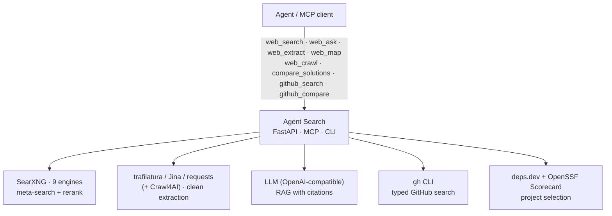

<div align="center">

# 🔎 Agent Search

**A self-hosted, MCP-native web-search backend for AI agents** — meta-search, clean extraction, RAG with citations, GitHub project selection, and a Tavily-compatible API. All free, all local.

[](LICENSE)


**English** · [简体中文](README.zh-CN.md)

</div>

---

## Why?

Built-in `WebSearch` / `WebFetch` give you links and snippets. Your agent still has to search → fetch → read → reconcile by hand, and the results are easily polluted by SEO blogs and inflated stars.

**Agent Search turns "search primitives" into "search outcomes":** aggregate many engines, rank with official-source priority, extract clean text, and answer with **chunk-level citations** — exposed as **one MCP server** any agent (Claude Code, Codex, Cursor, …) can call by default. It also does the things the built-ins can't: **typed GitHub search**, **first-party project comparison for tech selection**, **site mapping**, and a **Tavily-compatible** endpoint.

## ✨ Features

- **Meta-search over 9 engines** via [SearXNG](https://github.com/searxng/searxng) (Google/Bing/DDG/Brave/Wikipedia/GitHub/StackOverflow/Reddit/News) with URL dedup.
- **Smart local reranking** — boosts official docs / API / pricing / changelog pages, **down-weights SEO content farms**, multi-query expansion for doc & pricing intent.
- **Robust extraction** — `trafilatura → Jina Reader → requests` fallback chain, ratio-based noise cleaning (keeps tables/code/prices/dates), optional **Crawl4AI** for JS-heavy pages.
- **RAG with citations** — search → parallel multi-source fetch → LLM summary with `[1][2]` references and **per-source excerpts** (chunk-level evidence); bad body falls back to snippet.
- **GitHub, done right** — typed `repos/code/issues/prs` search via the `gh` CLI, returning `license / last-commit / archived / forks` for real evaluation, not just stars.
- **🆕 Tech-selection compare** — `github_compare` pulls **first-party facts** (`gh api`) + **OpenSSF Scorecard** health (via the free [deps.dev](https://deps.dev) API) and flags *archived / stale / no-release / copyleft*. Evidence, not verdicts.
- **🆕 Universal solution compare** — `compare_solutions` builds a **comparison matrix** for *any* candidates (OSS libs / SaaS / frameworks), not just GitHub repos: GitHub candidates reuse first-party `repo_facts`; non-GitHub ones get official-page rule extraction (price/version/license). **Every cell carries `source_url` + excerpt + confidence** (official/secondary/llm) — traceable, not a black box.
- **🆕 Deep research reports** — `web_research` runs a plan → fan-out → evidence → per-section synthesis pipeline: the LLM drafts an outline (sections + sub-queries), all sub-queries fire concurrently, top sources get fetched & quality-gated into a **globally numbered source pool**, then each section is written against its own sources with `[n]` citations, plus a conclusion and a code-assembled reference list. Pick a **report type** (`report_type=`): `standard` (default), `detailed` (5–6 deeper sections, more sources), `comparison` (sections organized as comparison dimensions, tables + charts, verdict-style selection advice), or `outline` (planning-only, returns in seconds — confirm the structure, then run the full report). A **gap-reflection round** then reviews the draft, re-searches under-evidenced sections from new angles, and rewrites them (new sources keep global numbering; `RESEARCH_MAX_ROUNDS`). Sections emit Markdown tables, **Vega-Lite charts rendered to inline SVG** (vector, via the optional `vl-convert-python` — no Node/browser; falls back to a ```vega-lite``` spec block for the consumer to render), and mermaid diagrams for flow/architecture. One call → a **multi-section, citation-backed Markdown report** (planning degrades gracefully to static fan-out if the LLM output can't be parsed).
- **🆕 Recursive deep crawl** — `web_crawl` follows links **2–6 levels deep** (BFS / best-first), returning clean per-page Markdown. Uses Crawl4AI's deep-crawl strategy when installed, else a dependency-free pure-Python BFS. Budget guards (depth/page/time/byte caps) + per-URL SSRF check on every enqueued link. `web_map` scouts (one level, links only); `web_crawl` goes deep (many levels, full text).
- **Typo-tolerant search** — layered fuzzy fallback: consume SearXNG `corrections` → rapidfuzz edit-distance correction → fuzzy rank bonus → LLM spelling rewrite (all silently degrade if deps absent). A query like `skil` still finds `skill`.
- **Site mapping** — `sitemap.xml` first, page-link fallback, same-domain dedup.
- **Tavily-compatible API** — drop-in `/tavily/search` with stable `include_raw_content`.
- **Caching** — SQLite TTL cache; works offline against the cache.

## 🎬 Demo

**Tech-selection comparison** — first-party facts + OpenSSF Scorecard health, never just stars:

```text
repo                 stars   license       last commit   scorecard   flags
fastapi/fastapi      99669   MIT           2026-06-25     7.8        -
django/django        87997   BSD-3-Clause  2026-06-25     6.8        [no release]
encode/starlette     12432   BSD-3-Clause  2026-06-19     7.5        -
```

**Search that prefers official docs** (content farms down-ranked automatically):

```text
$ agent-search "python asyncio tutorial"
[1] A Conceptual Overview of asyncio — Python 3 docs   https://docs.python.org/3/howto/...
[3] asyncio — Asynchronous I/O — Python 3 docs         https://docs.python.org/3/library/asyncio.html
...
```

## 🆚 How it compares

No single OSS project covers this niche — most are end-user apps, single-capability tools, or higher-level orchestrators.

| Project | Multi-engine | Extract (JS) | RAG + cites | GitHub typed | Site map | Native MCP | Tavily-compat |
|---|:--:|:--:|:--:|:--:|:--:|:--:|:--:|
| Firecrawl | ⚠️ single-src | ✅✅ | ✅ | ⚠️ | ✅ | ✅ | ❌ |
| Crawl4AI | ❌ | ✅✅ | ⚠️ | ❌ | ✅ | ✅ | ❌ |
| Perplexica | ✅ | ⚠️ | ✅ | ❌ | ❌ | ❌ | ❌ |
| GPT Researcher | ⚠️ | ✅ | ✅ report | ❌ | ❌ | ❌ | ❌ |
| SearXNG | ✅✅ | ❌ | ❌ | ❌ | ❌ | ❌ | ❌ |
| mcp-searxng | ✅ | ⚠️ | ❌ | ❌ | ❌ | ✅ | ❌ |
| **Agent Search** | **✅ 9** | ⚠️/✅ opt | **✅ chunk** | **✅✅** | **✅ + deep crawl** | **✅ 8 tools** | **✅ only one** |

## 🏗️ Architecture



## 🚀 Quickstart

**1. Start SearXNG (and optional FlareSolverr):**
```bash
cp .env.example .env          # then edit: SEARXNG_SECRET_KEY, (optional) LLM key
docker compose up -d searxng  # add `flaresolverr` only if you need anti-bot handling
```

**2. Install the Python side:**
```bash
python -m venv .venv && source .venv/bin/activate
pip install -r requirements.txt              # core
pip install -r requirements-optional.txt     # optional: better extraction (trafilatura)
```
Or install the CLIs globally with [pipx](https://pipx.pypa.io) / [uv](https://docs.astral.sh/uv/) (from a clone):
```bash
pipx install .        # → `agent-search`, `agent-search-mcp`, `agent-search-server`
```

**3. Use it** — three ways:
```bash
# CLI
python search.py "python asyncio tutorial"
python search.py "Anthropic Claude API pricing" --answer

# HTTP API (binds 127.0.0.1 by default)
python server.py          # → http://127.0.0.1:8077/docs

# MCP (Claude Code / Cursor / Codex …)
cp .mcp.json.example .mcp.json   # set the absolute path to this repo
```

## 🧰 MCP tools

| Tool | What it does |
|---|---|
| `web_search` | Meta-search, ranked results |
| `web_ask` | RAG answer with `[n]` citations + per-source excerpts |
| `web_research` | Multi-section research report (outline → concurrent fan-out → cited sections + references) |
| `web_extract` | Fetch a page → clean Markdown |
| `web_map` | Discover a site's links (sitemap-first) |
| `web_crawl` | Recursive deep crawl 2–6 levels (links + per-page Markdown, budget + SSRF guarded) |
| `compare_solutions` | Universal solution comparison matrix (any candidates; each cell traceable to a source) |
| `github_search` | Typed `repos/code/issues/prs` search |
| `github_compare` | First-party tech-selection comparison (facts + OpenSSF Scorecard) |

> 💡 **Coverage depends on your SearXNG instance & region.** The bundled config ships some China-friendly engines (e.g. Doubao), so an instance hosted in or tuned for **mainland China** tends to rank Chinese sources higher and some international/English sources lower (and vice-versa elsewhere). For the widest reach, have your agent run its **native** `WebSearch`/`WebFetch` **in parallel** and merge — Agent Search for aggregation/RAG/GitHub, native search for extra reach. You can also add/remove engines in `searxng/settings.yml`.

## ⚠️ Notes & limitations

- `web_ask` (RAG) and `web_research` (report) need an OpenAI-compatible LLM key; everything else (search/extract/map/github) needs **no API key**. `web_research` is the heaviest tool (sections+2 LLM calls, ~1–3 min); install the optional `vl-convert-python` to get inline **SVG** charts instead of raw Vega-Lite specs.
- Extraction does **not** render JS by default — install the optional `crawl4ai` and use `deep=True` for JS-heavy pages.
- Built for **local / trusted use**: the HTTP server binds `127.0.0.1` by default and extraction has an SSRF guard (blocks localhost / private / cloud-metadata IPs). Add auth + a reverse proxy before exposing it.
- This is a personal project, maintained best-effort. Issues/PRs welcome but no SLA.

## 🙏 Acknowledgements

Stands on the shoulders of: [SearXNG](https://github.com/searxng/searxng) · [trafilatura](https://github.com/adbar/trafilatura) · [Jina Reader](https://github.com/jina-ai/reader) · [Crawl4AI](https://github.com/unclecode/crawl4ai) · [FlareSolverr](https://github.com/FlareSolverr/FlareSolverr) · [OpenSSF Scorecard](https://github.com/ossf/scorecard) + [deps.dev](https://deps.dev) · [GitHub CLI](https://github.com/cli/cli) · FastAPI · the [Model Context Protocol](https://modelcontextprotocol.io). RAG summaries via any OpenAI-compatible endpoint (e.g. DeepSeek).

## 📄 License

[MIT](LICENSE) — do whatever, no warranty. Agent Search orchestrates SearXNG as a separate service (it does not bundle or modify SearXNG's source), so its AGPL does not extend to this project.
