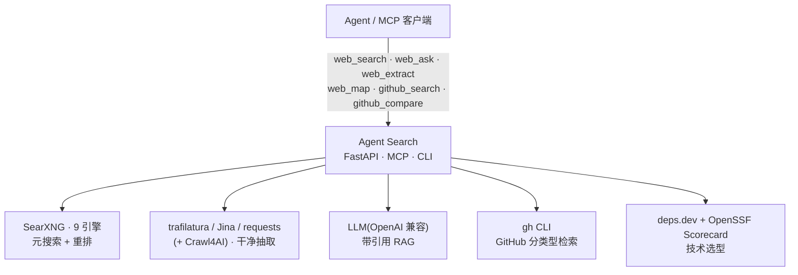

<div align="center">

# 🔎 Agent Search

**给 AI agent 用的自托管、MCP 原生 联网搜索后端** —— 多引擎聚合、干净抽取、带引用的 RAG、GitHub 选型对比、Tavily 兼容接口。全部免费、全部本地。

[](LICENSE)


[English](README.md) · **简体中文**

</div>

---

## 为什么要它？

内置的 `WebSearch` / `WebFetch` 只给你链接和摘要 —— agent 还得自己 搜索 → 抓取 → 阅读 → 交叉核对，而且结果很容易被 SEO 软文和虚高 star 污染。

**Agent Search 把"搜索原语"变成"搜索成品"：** 多引擎聚合、官方源优先重排、抽取干净正文、给出**带 chunk 级引用**的答案 —— 并暴露成**一个 MCP server**，让任何 agent（Claude Code / Codex / Cursor……）默认就能调用。它还做内置工具做不到的事：**GitHub 分类型检索**、**基于一手数据的技术选型对比**、**站点地图**、**Tavily 兼容**端点。

## ✨ 特性

- **9 引擎元搜索**：基于 [SearXNG](https://github.com/searxng/searxng)（Google/Bing/DDG/Brave/维基/GitHub/StackOverflow/Reddit/News），URL 去重。
- **本地智能重排**：官方文档 / API / 价格 / changelog 页面加权，**SEO 内容农场降权**，对文档与价格意图做多查询扩展。
- **健壮抽取**：`trafilatura → Jina Reader → requests` 兜底链，按噪声占比清洗（保留表格/代码/价格/日期），JS 重页面可选 **Crawl4AI**。
- **带引用 RAG**：搜索 → 并行多源抓正文 → LLM 生成带 `[1][2]` 引用的答案，**每个来源带 excerpt**（chunk 级证据）；正文坏了用 snippet 兜底。
- **GitHub 做对**：`gh` CLI 分类型检索 `repos/code/issues/prs`，repos 返回 `license / 最近提交 / 是否归档 / forks`，能真正评估而不止看 star。
- **🆕 技术选型对比**：`github_compare` 拉取**一手事实**（`gh api`）+ **OpenSSF Scorecard** 健康分（经免费的 [deps.dev](https://deps.dev) API），并标注 *已归档 / 长期无提交 / 无 release / copyleft*。**只给证据，不替你下结论。**
- **站点地图**：`sitemap.xml` 优先，页面链接兜底，同域去重。
- **Tavily 兼容接口**：`/tavily/search` 直接替换，`include_raw_content` 稳定。
- **缓存**：SQLite TTL 缓存，可离线复用。

## 🎬 效果演示

**技术选型对比** —— 一手事实 + OpenSSF Scorecard 健康分,不只看 star:

```text
仓库                 star    license       最近提交       健康分   标记
fastapi/fastapi      99669   MIT           2026-06-25     7.8     -
django/django        87997   BSD-3-Clause  2026-06-25     6.8     [无 release]
encode/starlette     12432   BSD-3-Clause  2026-06-19     7.5     -
```

**搜索自动把官方文档顶上来**(内容农场降权):

```text
$ agent-search "python asyncio tutorial"
[1] A Conceptual Overview of asyncio — Python 3 文档   https://docs.python.org/3/howto/...
[3] asyncio — Asynchronous I/O — Python 3 文档         https://docs.python.org/3/library/asyncio.html
...
```

## 🆚 横向对比

这个细分位没有正面竞品 —— 别家要么是终端产品、要么是单点能力、要么是上层编排。

| 项目 | 多引擎 | 抽取(JS) | RAG+引用 | GitHub 分类型 | 站点 map | 原生 MCP | Tavily 兼容 |
|---|:--:|:--:|:--:|:--:|:--:|:--:|:--:|
| Firecrawl | ⚠️ 单源 | ✅✅ | ✅ | ⚠️ | ✅ | ✅ | ❌ |
| Crawl4AI | ❌ | ✅✅ | ⚠️ | ❌ | ✅ | ✅ | ❌ |
| Perplexica | ✅ | ⚠️ | ✅ | ❌ | ❌ | ❌ | ❌ |
| GPT Researcher | ⚠️ | ✅ | ✅ 报告级 | ❌ | ❌ | ❌ | ❌ |
| SearXNG | ✅✅ | ❌ | ❌ | ❌ | ❌ | ❌ | ❌ |
| mcp-searxng | ✅ | ⚠️ | ❌ | ❌ | ❌ | ✅ | ❌ |
| **Agent Search** | **✅ 9** | ⚠️/✅ 可选 | **✅ chunk** | **✅✅** | **✅** | **✅ 6 工具** | **✅ 唯一** |

## 🏗️ 架构



## 🚀 快速开始

**1. 起 SearXNG（FlareSolverr 可选）：**
```bash
cp .env.example .env          # 然后填：SEARXNG_SECRET_KEY、(可选) LLM key
docker compose up -d searxng  # 需要反爬时再加 `flaresolverr`
```

**2. 装 Python 侧：**
```bash
python -m venv .venv && source .venv/bin/activate
pip install -r requirements.txt              # 核心
pip install -r requirements-optional.txt     # 可选：更强抽取(trafilatura)
```
或用 [pipx](https://pipx.pypa.io) / [uv](https://docs.astral.sh/uv/) 全局装命令(在 clone 目录里)：
```bash
pipx install .        # → `agent-search`、`agent-search-mcp`、`agent-search-server`
```

**3. 三种用法：**
```bash
# 命令行
python search.py "python asyncio 教程"
python search.py "Anthropic Claude API 定价" --answer

# HTTP API（默认绑 127.0.0.1）
python server.py          # → http://127.0.0.1:8077/docs

# MCP（Claude Code / Cursor / Codex …）
cp .mcp.json.example .mcp.json   # 填本仓库的绝对路径
```

## 🧰 MCP 工具

| 工具 | 作用 |
|---|---|
| `web_search` | 元搜索，重排后的结果 |
| `web_ask` | 带 `[n]` 引用 + 每源 excerpt 的 RAG 答案 |
| `web_extract` | 抓页面 → 干净 Markdown |
| `web_map` | 发现站点链接（sitemap 优先） |
| `github_search` | 分类型 `repos/code/issues/prs` 检索 |
| `github_compare` | 一手数据技术选型对比（事实 + OpenSSF Scorecard） |

> 💡 **覆盖范围取决于你的 SearXNG 实例与所在地区。** 自带配置含一些国内友好的引擎(如豆包)，因此**部署在中国大陆/按 CN 调优**的实例会让中文源排得更靠前、部分国际/英文源更靠后(在别处则相反)。要覆盖更广，可让 agent **并行**调用它自带的 `WebSearch`/`WebFetch` 再合并 —— Agent Search 负责聚合/RAG/GitHub，自带搜索补充覆盖；也可在 `searxng/settings.yml` 增删引擎。

## ⚠️ 说明与限制

- `web_ask`（RAG）需要一个 OpenAI 兼容的 LLM key；其余（搜索/抽取/map/github）**无需任何 API key**。
- 抽取默认**不渲染 JS**；JS 重页面请装可选的 `crawl4ai` 并用 `deep=True`。
- 面向**本地/可信环境**：HTTP 默认绑 `127.0.0.1`，抽取带 SSRF 防护（拦截 localhost / 私网 / 云元数据 IP）。对外暴露前请自加认证与反向代理。
- 个人项目，best-effort 维护；欢迎 issue/PR，但无 SLA。

## 🙏 致谢

站在这些项目的肩膀上：[SearXNG](https://github.com/searxng/searxng) · [trafilatura](https://github.com/adbar/trafilatura) · [Jina Reader](https://github.com/jina-ai/reader) · [Crawl4AI](https://github.com/unclecode/crawl4ai) · [FlareSolverr](https://github.com/FlareSolverr/FlareSolverr) · [OpenSSF Scorecard](https://github.com/ossf/scorecard) + [deps.dev](https://deps.dev) · [GitHub CLI](https://github.com/cli/cli) · FastAPI · [Model Context Protocol](https://modelcontextprotocol.io)。RAG 总结走任意 OpenAI 兼容端点（如 DeepSeek）。

## 📄 许可

[MIT](LICENSE) —— 随便用，无担保。本项目把 SearXNG 作为独立服务编排（不打包、不修改其源码），因此其 AGPL 不传染到本项目。
